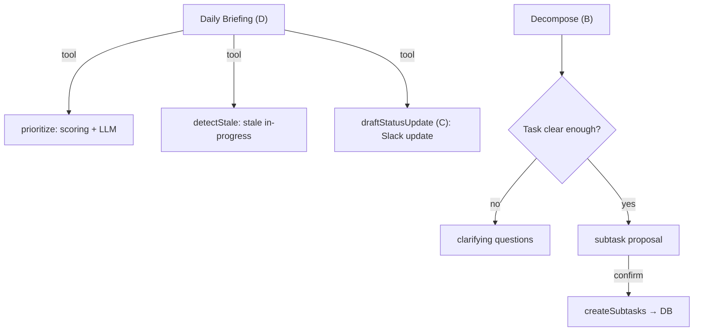

# DevLog

Task tracker with AI agents: task and subtask CRUD, filtering/sorting, three agent features (prioritization, decomposition, morning briefing). Runs locally without API keys in mock mode.

**Stack:** Next.js 16 (App Router) · React 19 · TypeScript · SQLite (`better-sqlite3`) · Vercel AI SDK · TanStack Query · Zod · shadcn/ui

---

## Quick Start

**Requires:** Node.js ≥ 20.9

```bash
npm install
npm run dev
```

Open [http://localhost:3000](http://localhost:3000).

`.env` is optional — without LLM keys, **mock mode** kicks in automatically. For a real LLM:

```bash
cp .env.example .env.local   # Windows: copy .env.example .env.local
```

First run creates `devlog.db` in the project root. No demo data is seeded — the task list starts empty (intentional; see below).

### Other commands

| Command | Description |
|---------|-------------|
| `npm run build` | Production build |
| `npm run start` | Serve after build |
| `npm run lint` | ESLint |
| `npm test` | Vitest (unit tests for agent logic) |
| `npm run format` | Prettier |

---

## Architecture

Single Next.js project, no separate backend. Route Handlers = REST API, repositories = data access, AI logic isolated in `lib/ai/`.

```
Browser (React client components)
  ↓ TanStack Query — hooks/useTasks.ts, hooks/useAgents.ts
  ↓ fetch → /api/*
Route Handlers — app/api/**/route.ts
  ↓ Zod validation
Repository — lib/repo/*
  ↓
SQLite (devlog.db)  or  JSON (devlog.json)

Agent routes → lib/ai/* → Vercel AI SDK → provider or mock
```

### Layers

| Layer | Location | Role |
|-------|----------|------|
| UI | `app/page.tsx`, `components/tasks/`, `components/agents/` | Task board, forms, agent dialogs |
| Client data | `hooks/`, `lib/api-client.ts`, `lib/agent-api-client.ts` | TanStack Query, HTTP |
| API | `app/api/tasks/`, `app/api/agents/` | REST JSON, `runtime = 'nodejs'` |
| Domain | `lib/schema.ts` | Zod schemas + `z.infer` types |
| Persistence | `lib/db.ts`, `lib/repo/` | SQLite or JSON fallback |
| AI | `lib/ai/` | Scoring, tools, agents, mock |

### AI agents (3 of 4 planned)

Feature **C** (status update) is not a separate endpoint — it is the `draftStatusUpdate` tool inside **D** (Daily Briefing).



| Agent | Endpoint | What it does |
|-------|----------|--------------|
| **A — Prioritize** | `POST /api/agents/prioritize` | Deterministic scoring → LLM builds a daily plan with explanation |
| **B — Decompose** | `POST /api/agents/decompose` | Clarity classification → questions or subtasks → DB write on confirm |
| **D — Briefing** | `POST /api/agents/briefing` | Multi-step tool-calling: prioritize + detectStale + draftStatusUpdate → markdown briefing |

**A** does not just sort — it runs `scoreTask()` first (priority weight + age decay + status penalty), then the LLM explains the order.

---

## Storage: SQLite + limitations

### Why SQLite (`better-sqlite3`)

- Zero config: single `devlog.db` file, no Docker/Postgres
- Synchronous API — simple CRUD in Route Handlers without an ORM
- Persistence out of the box for a local one-user tracker
- WAL + prepared statements + foreign keys in `lib/db.ts`

### Fallback: JSON

If the native `better-sqlite3` build fails:

```env
STORAGE_BACKEND=json
```

Data goes to `devlog.json` (same CRUD interface via `lib/repo/json-store.ts`).

### Limitations

| Limitation | Consequence |
|------------|-------------|
| **Single-writer** | SQLite allows one writer; not for high concurrent load |
| **Local file** | `devlog.db` / `devlog.json` in cwd; on serverless without a volume, data is lost |
| **Node runtime only** | All API routes: `export const runtime = 'nodejs'` — Edge does not support the native addon |
| **No multi-tenant** | No `user_id` — all tasks are shared for the instance |
| **Inline migrations** | Schema in `lib/db.ts`, not separate migration files |

DB files are in `.gitignore` — not committed.

### Data model

- **`tasks`** — id, title, description, status (`todo` \| `in-progress` \| `done`), priority (`low` \| `medium` \| `high`), createdAt, statusUpdatedAt
- **`subtasks`** — id, taskId (FK, CASCADE), title, status (`todo` \| `done`), createdAt

---

## Mock LLM mode

Without an API key the app **works fully** — AI features are visible in the UI with a “Mock LLM” badge.

### How to enable / disable

| Mode | Config |
|------|--------|
| **Mock (default)** | Do not create `.env` or leave the key empty |
| **OpenAI** | `LLM_PROVIDER=openai` + `OPENAI_API_KEY=sk-...` |
| **Anthropic** | `LLM_PROVIDER=anthropic` + `ANTHROPIC_API_KEY=...` |
| **Google** | `LLM_PROVIDER=google` + `GOOGLE_GENERATIVE_AI_API_KEY=...` |
| **Groq** | `LLM_PROVIDER=groq` + `GROQ_API_KEY=...` |

Optional: `AI_MODEL=` — model override (defaults: `gpt-4.1-mini`, `claude-sonnet-4-20250514`, `gemini-2.0-flash`, `openai/gpt-oss-20b`).

### Fallback logic (`lib/ai/provider.ts`)

1. Reads `LLM_PROVIDER` (default: `openai`)
2. If there is **no key** for the chosen provider → **mock** (does not auto-switch to another provider)
3. Mock: `MockLanguageModelV3` — deterministic responses by keywords (`prioritize`, `decompose`, `briefing`, `status`)
4. Tool-calling in mock: step 1 — call tools, step 2 — text synthesis

> `LLM_PROVIDER=mock` in `.env.example` is a hint for reviewers; in code `mock` is not a separate env value — it is the automatic fallback when no key is present.

---

## Environment variables

```env
LLM_PROVIDER=mock          # openai | anthropic | google | groq
OPENAI_API_KEY=
ANTHROPIC_API_KEY=
GOOGLE_GENERATIVE_AI_API_KEY=
GROQ_API_KEY=
AI_MODEL=                    # optional
STORAGE_BACKEND=             # json — instead of SQLite
```

---

## Intentionally not built

| Decision | Why |
|----------|-----|
| **Auth / sessions** | Local single-user tracker; auth is over-engineering with no real need |
| **Deploy / Docker / CI** | Out of test scope; `npm install && npm run dev` is enough to verify |
| **E2E (Playwright) / perf audit** | Instead — unit tests on pure functions + manual visual QA |
| **4th AI feature as standalone** | C (status update) is a tool in D; less duplication, more agentic behavior |
| **Demo task seed** | Clean storage on first run; reviewer adds their own tasks |
| **ORM (Prisma/Drizzle)** | Two tables — raw SQL + Zod is simpler and more transparent |
| **Feature flags / analytics / Sentry** | Out of scope |
| **Rate limiting / security headers** | No auth — API is public for local use |

Full decision log — [`AGENT_LOG.md`](./AGENT_LOG.md).

---

## Key files

| File | Purpose |
|------|---------|
| `lib/schema.ts` | Zod schemas, single source of types |
| `lib/db.ts` | SQLite init, migrations, WAL |
| `lib/repo/tasks.ts` | Task CRUD |
| `lib/ai/scoring.ts` | Deterministic scoring for Prioritize |
| `lib/ai/tools.ts` | Agent tools (prioritize, detectStale, draftStatusUpdate, createSubtasks) |
| `lib/ai/provider.ts` | LLM selection + mock fallback |
| `hooks/useTasks.ts` | TanStack Query for tasks |
| `components/tasks/tasks-board.tsx` | Main UI |
| `components/agents/` | Agent dialogs |

---

## API (brief)

| Method | Path | Description |
|--------|------|-------------|
| GET | `/api/tasks?status=&sort=` | List tasks + subtasks |
| POST | `/api/tasks` | Create task |
| GET/PATCH/DELETE | `/api/tasks/:id` | CRUD by id |
| PATCH/DELETE | `/api/subtasks/:id` | Toggle done / delete |
| POST | `/api/agents/prioritize` | Daily plan |
| POST | `/api/agents/decompose` | Split task (2-phase: analyze → confirm) |
| POST | `/api/agents/briefing` | Morning briefing |

No auth — all endpoints are public.
